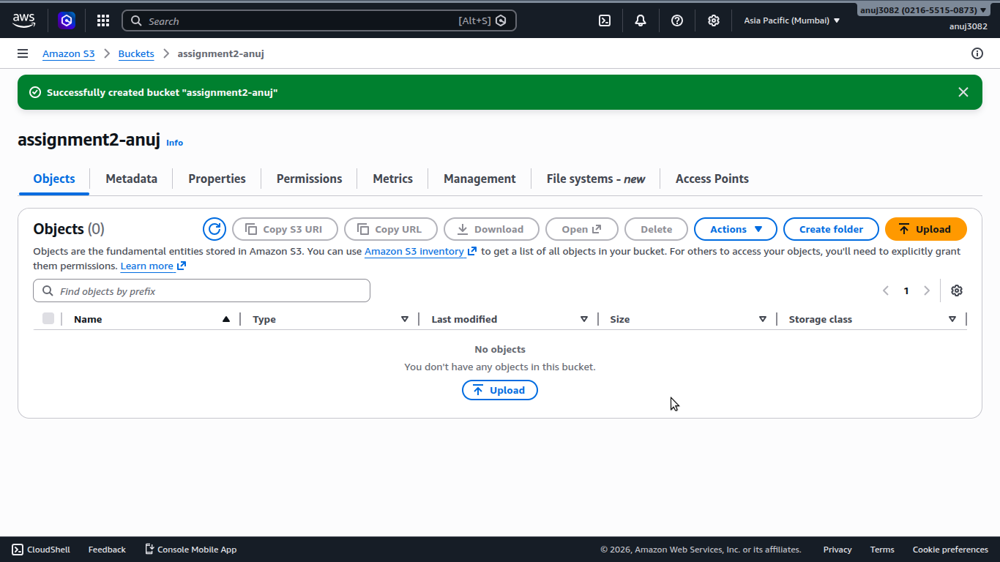
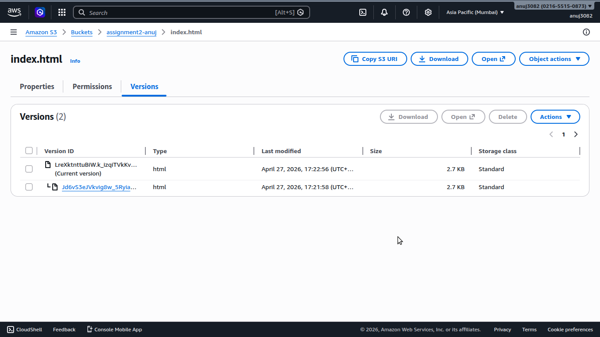
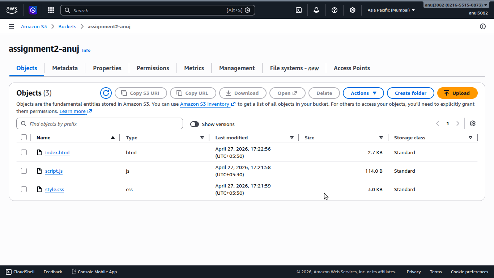
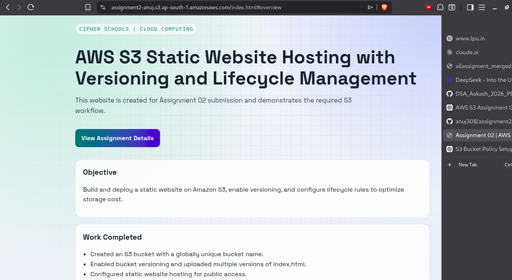
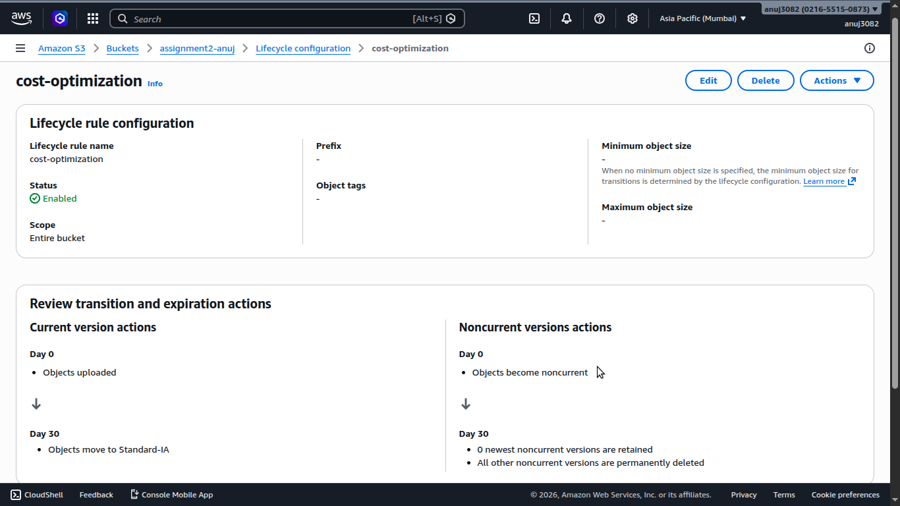

# Assignment 02: AWS S3 Static Website Hosting with Versioning and Lifecycle Management

## Student Details
- Name: Anuj Kumar Sharma
- Registration Number: 12305174

## Deployed Website Link
- S3 Website URL: https://assignment2-anuj.s3.ap-south-1.amazonaws.com/index.html

## Project Overview
This repository contains the static website files used for Assignment 02. The project demonstrates:
- AWS S3 bucket creation
- Versioning in S3
- Static website hosting
- Lifecycle rule configuration for cost optimization

## Repository Structure
- index.html
- style.css
- script.js

## Screenshots (Compulsory)
Add screenshots in this section and ensure your AWS username is clearly visible in each image.

1. Created bucket

2. Versioning view showing multiple versions of a file

3. Bucket with files visible

4. S3 website open in browser

5. Lifecycle rule configuration

## S3 Setup Summary
- Bucket Name: assignment2-anuj
- Versioning: Enabled
- Static Website Hosting: Enabled
- Lifecycle Rules: Configured

## Challenges Faced
- Example: Handling public access settings for S3 static website hosting.
- Example: Understanding transition and expiration actions in lifecycle rules.

## Notes
Keep your S3 website active until 27/04/2026, 11:59 PM as required in the assignment instructions.
